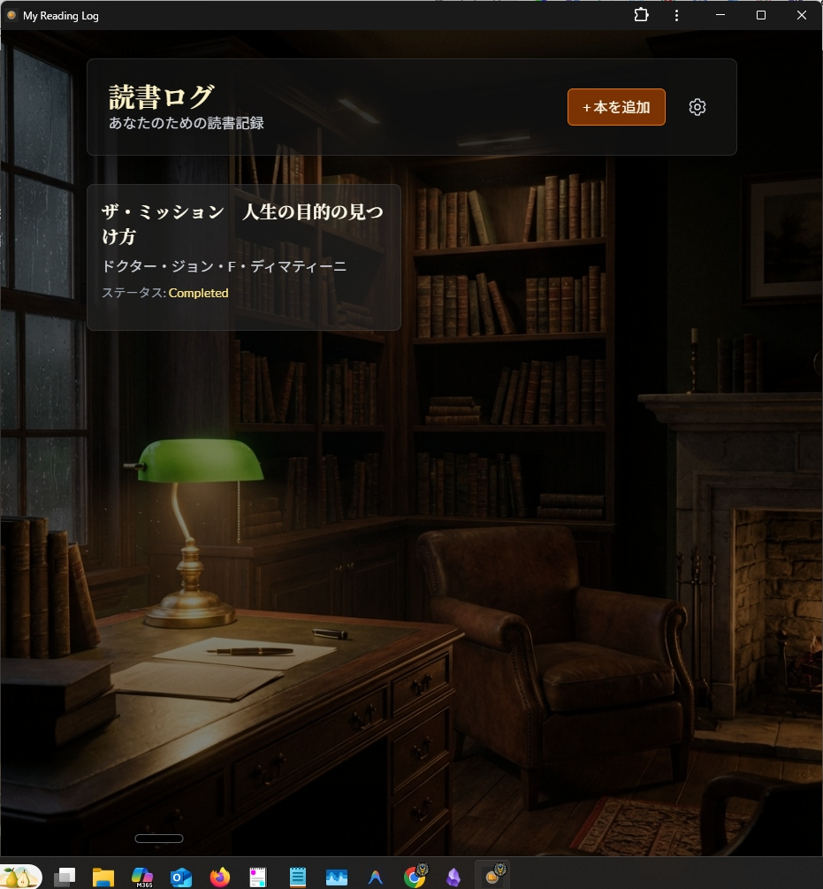

<div align="center">
  <h1>📚 読書ログ</h1>
  <p><strong>AIと共に読書体験を深めるパーソナル読書記録アプリ</strong></p>

  <p>
    <a href="#プロジェクトについて"><strong>概要</strong></a> •
    <a href="#機能"><strong>機能</strong></a> •
    <a href="#はじめに"><strong>はじめに</strong></a> •
    <a href="#使い方"><strong>使い方</strong></a> •
    <a href="#技術スタック"><strong>技術</strong></a>
  </p>

  
  
  
  
  
</div>

---

## スクリーンショット

<div align="center">
  
  <p><em>「静かな書斎」テーマの読書ログアプリ</em></p>
</div>

---

## プロジェクトについて

**読書ログ**は、読書体験を深めたい読書家のための個人用読書記録アプリケーションです。本を記録し、AIと対話しながら考えを深め、印象を画像として可視化できます。すべて静かな書斎のような落ち着いた雰囲気の中で。

### なぜこのアプリ？

読書は単に文字を消費することではありません。振り返り、つながり、洞察を得ることです。このアプリは以下をサポートします：

- **記憶する** - 整理されたノートとステータス管理で読んだ内容を記録
- **内省する** - AIパートナーと本について対話しながら考えを深める
- **可視化する** - 抽象的な印象を美しいAI生成画像に変換
- **没入する** - 気が散らない「静かな書斎」の雰囲気を楽しむ

### 主な特徴

- ✅ **AI対話機能**: Gemini 2.5 Flashと本について対話
- ✅ **印象の可視化**: Gemini 3 Pro Imageで感想をアート作品に
- ✅ **オフライン対応**: PWAとして完全にオフラインで動作
- ✅ **ローカルデータ**: 読書履歴はデバイス内に安全に保存
- ✅ **美しいデザイン**: 図書館テーマのUIとグラスモーフィズム効果

---

## 機能

### 📖 本の管理
- 個人ライブラリに本を追加、編集、削除
- 読書ステータスの管理：読みたい、読書中、完了
- 各本のノート、レビュー、評価を記録

### 🤖 AI読書パートナー
- **モデル**: Gemini 2.5 Flash
- 本についての感想や考えを対話
- 会話中にAI生成の要約を取得
- 対話内容に基づいた次の本のおすすめ

### 🎨 印象の可視化
- **モデル**: Gemini 3 Pro Image Preview
- 書いたノートや感想から画像を生成
- 読書体験の雰囲気、テーマ、シーンを視覚化

### 📱 Progressive Web App (PWA)
- モバイル・デスクトップにスタンドアロンアプリとしてインストール
- 完全なオフラインサポート
- 厳格なキャッシュ無効化戦略による自動更新
- インターネット接続なしでシームレスに動作

### 🔒 プライバシー優先
- **ローカルファースト設計**: 全データをIndexedDBに保存
- 外部データベースやサーバー依存なし
- 読書履歴とノートはデバイスから外に出ません

---

## はじめに

### 前提条件

- **Node.js** 18.0 以上
- **npm**（Node.jsに付属）

### インストール

1. **リポジトリをクローン**
   ```bash
   git clone https://github.com/your-username/app044-reading-log.git
   cd app044-reading-log
   ```

2. **依存関係をインストール**
   ```bash
   npm install
   ```

3. **開発サーバーを起動**
   ```bash
   npm run dev
   ```

4. **ブラウザで開く**

   [http://localhost:3000](http://localhost:3000) にアクセス

### 本番ビルド

```bash
npm run build
npm start
```

アプリが最適化され、デプロイ準備が完了します。

---

## 使い方

### 1. APIキーの設定

初回起動時に**Google Gemini APIキー**の入力を求められます：

- ヘッダーの設定アイコン（⚙️）をクリック
- モーダルにAPIキーを入力
- キーはブラウザのローカルストレージに安全に保存されます

> **APIキーの取得**: [Google AI Studio](https://aistudio.google.com/apikey)

### 2. 本を追加

- **「本を追加」**ボタンをクリック
- 本の詳細（タイトル、著者、ステータス、ノート、評価）を入力
- ライブラリに保存

### 3. AIと対話

- ライブラリから本を開く
- **「チャット」**タブに移動
- 本についてAIと会話を始める
- 要約、洞察、おすすめを聞く

### 4. 印象を可視化

- 本についての印象やノートを書く
- **「印象を可視化」**をクリック
- AIがあなたの考えを表現する画像を生成
- 生成された画像を保存または共有

### 5. アプリとしてインストール（PWA）

- **Chrome/Edge**: アドレスバーのインストールアイコンをクリック
- **iOS Safari**: 共有 → ホーム画面に追加
- **Android Chrome**: メニュー → アプリをインストール

---

## 技術スタック

### フロントエンド
- **[Next.js 16.0](https://nextjs.org/)** - App Routerを搭載したReactフレームワーク
- **[React 19.2](https://react.dev/)** - UIライブラリ
- **[TypeScript](https://www.typescriptlang.org/)** - 型安全な開発
- **[Tailwind CSS v4](https://tailwindcss.com/)** - ユーティリティファーストのスタイリング
- **[Framer Motion](https://www.framer.com/motion/)** - スムーズなアニメーション

### AI & API
- **[@google/generative-ai](https://ai.google.dev/)** - Google Gemini API SDK
  - **gemini-2.5-flash**: テキスト生成とチャット
  - **gemini-3-pro-image-preview**: 画像生成

### データ & ストレージ
- **[Dexie](https://dexie.org/)** - IndexedDBラッパー
- **[dexie-react-hooks](https://dexie.org/docs/dexie-react-hooks/useLiveQuery())** - React統合
- 外部データベース不要のローカルファースト設計

### PWA
- **[@ducanh2912/next-pwa](https://github.com/DuCanhGH/next-pwa)** - Next.js用PWAサポート
- 厳格なキャッシュ無効化を備えたService Worker
- Workboxによるオフラインファースト戦略

### なぜこれらの技術？

- **Next.js 16**: Server ComponentsとApp Routerによる最適なパフォーマンス
- **React 19**: 並行機能と改善されたレンダリング
- **Gemini API**: テキストと画像生成のための最先端マルチモーダルAI
- **Dexie**: ローカルデータ永続化のための堅牢なPromiseベースIndexedDBソリューション
- **Tailwind CSS v4**: ランタイムオーバーヘッドゼロのモダンで高性能なスタイリング
- **PWA**: オフラインサポートを備えたネイティブアプリライクな体験

---

## ロードマップ

- [x] 本の管理（追加、編集、削除）
- [x] 読書ステータス管理
- [x] ノートと評価
- [x] AIチャットパートナー（Gemini 2.5 Flash）
- [x] 印象の可視化（Gemini 3 Pro Image）
- [x] オフライン機能を備えたPWAサポート
- [x] 厳格なキャッシュ無効化による更新
- [ ] JSON/CSV形式でのデータエクスポート
- [ ] Goodreadsからの本のインポート
- [ ] 多言語サポート
- [ ] ダーク/ライトテーマ切り替え
- [ ] 読書統計ダッシュボード
- [ ] 外部API経由の本検索（Google Books、Open Library）

---

## プロジェクト構成

```
app044-reading-log/
├── app/                    # Next.js App Router
│   ├── actions/           # サーバーアクション（AI統合）
│   ├── layout.tsx         # ルートレイアウト
│   └── page.tsx           # ホームページ
├── components/            # Reactコンポーネント
│   ├── ApiKeyModal.tsx   # APIキー設定モーダル
│   └── SettingsMenu.tsx  # 設定メニュー
├── public/               # 静的アセット
│   └── sw.js            # Service Worker
├── doc/                  # ドキュメント
│   └── requirement_definition.md
└── package.json          # 依存関係
```

---

## デザイン哲学

### 「静かな書斎」テーマ

このアプリは**静かな図書館**や**個人の書斎**の雰囲気を呼び起こすようデザインされています：

- **背景**: アンティークな机、本、温かい照明
- **UI**: 背景に溶け込むグラスモーフィズムのオーバーレイ
- **配色**: 読書の邪魔にならない温かみのある落ち着いたトーン
- **タイポグラフィ**: 長文でも快適に読めるクリーンで読みやすいフォント

### ローカルファースト、プライバシーファースト

すべてのデータはあなたのデバイスに保存されます。アカウント不要、サーバー不要、トラッキングなし。

---

## ライセンス

このプロジェクトは個人使用と学習目的で提供されています。

---

## 謝辞

- **[Best-README-Template](https://github.com/othneildrew/Best-README-Template)** - README構造のインスピレーション
- **[Google Gemini](https://ai.google.dev/)** - インテリジェント機能を支えるAIモデル
- **[Next.js](https://nextjs.org/)** - 素晴らしいReactフレームワーク
- **[Dexie.js](https://dexie.org/)** - 優れたIndexedDBライブラリ
- **読書コミュニティ** - このプロジェクトのインスピレーション

---

<div align="center">
  <p>本好きのために 📚 を込めて</p>
  <p><sub>100Appsプロジェクトシリーズの一部</sub></p>
</div>
